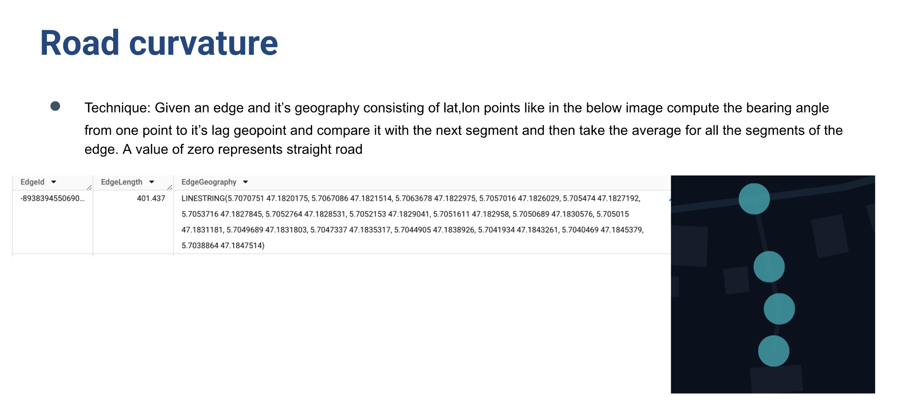

# Road-curvature
Detect curvature of the road using edge geometry

## Terminology:

**Bearing angle:**

The bearing angle between two geographic points (GeogPointLag and GeogPoint) represents the direction from one point to another, measured clockwise from true North:

0°: Directly North.

90°: Directly East.

180°: Directly South.

270°: Directly West.

# Results

## Getting a straight road segment on a Highway/Primary road

https://youtu.be/-LORDtV_0g8

## Getting a straight road segment on a Secondary road

https://youtu.be/kkLkt2UYHwc
